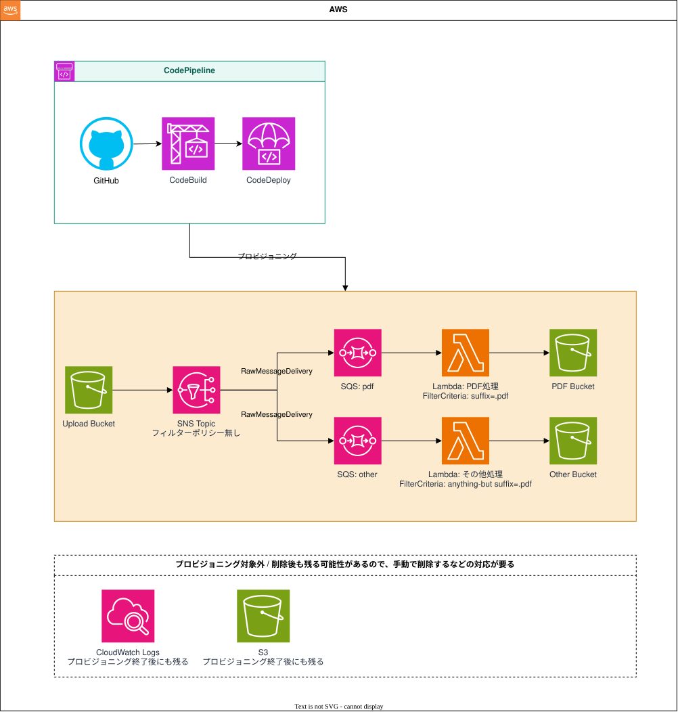
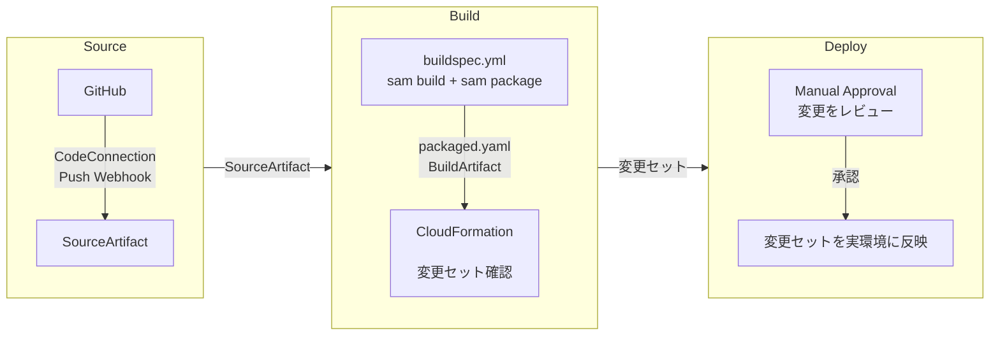

# simple-sam

入力イベントの内容に関係なく `Hello, World!` を返す、最小構成の AWS Lambda サンプル。

## リポジトリ構成

```text
├─ src/
│  └─ app.py                  Lambda ハンドラ
├─ img/
│  └─ architechchar.drawio    システム構成図
├─ template.yaml              SAM アプリケーションスタック
├─ codepipeline.yml           CI/CD ブートストラップスタック
└─ buildspec.yml              CodeBuild のビルドステージ
```

## AWS構成図



- Infrastructure as Code（IaC）として、インフラの定義をコード管理する（[template.yaml](template.yaml)）
- Lambda に載せるアプリケーションも、本リポジトリで管理する（[./src/](./src/)）
- CodePipeline で CI/CD を実現する（[codepipeline.yml](codepipeline.yml)）


## CI/CD([codepipeline.yml](codepipeline.yml))のイメージ

- ビルドステージで実行する内容は[buildspec.yml](buildspec.yml)に記載する



## 構築手順

AWS コンソールから手動で実施する場合

1. **初回のみ**: CloudFormation コンソールで **Create stack** → **With new resources (standard)** を選択する
2. **Upload a template file** を選択し、`codepipeline.yml` をアップロードする
3. スタック名に `simple-sam-pipeline` を入力する
4. 次のパラメータを入力する
  - `ConnectionArn`: GitHub 用の承認済み CodeConnection ARN
  - `RepositoryId`: GitHub リポジトリ（`OwnerName/RepositoryName` 形式）
  - `BranchName`: `main`
  - `AppStackName`: 任意のスタック名（例: `stack-simple-sam`）
5. IAM リソースの作成を認識するチェックボックスを選択する
6. スタックを作成する
7. 次のいずれかの方法でパイプラインを起動する
  - GitHub の `main` ブランチへ push する
  - CodePipeline コンソールで対象パイプラインを開き、**Release change** を選択する

2回目以降は、GitHub の `main` ブランチへの push または CodePipeline の **Release change** で実行できる。

## Lambda の動作確認

デプロイ後、AWS Lambda コンソールのテスト機能からレスポンスを確認する。

1. AWS Lambda コンソールで対象の関数を開く
2. **Test** タブを開く
3. 任意のイベント名を入力し、次の JSON をイベントとして保存する

   ```json
   {
     "message": "any input"
   }
   ```

4. **Test** をクリックして実行する
5. 実行結果のレスポンスを確認する

入力値に関係なく、次のようなレスポンスが返れば動作確認完了。

```json
{
  "statusCode": 200,
  "body": "Hello, World!"
}
```

## 実装メモ

### ローカルでLambdaの動作確認をする場合

```bash
python3.13 -m venv .venv
source .venv/bin/activate

# テンプレートを検証
sam validate --lint
cfn-lint template.yaml codepipeline.yml

# ビルド
sam build

# ローカル呼び出し
sam local invoke HelloWorldFunction -e events/event.json
```
