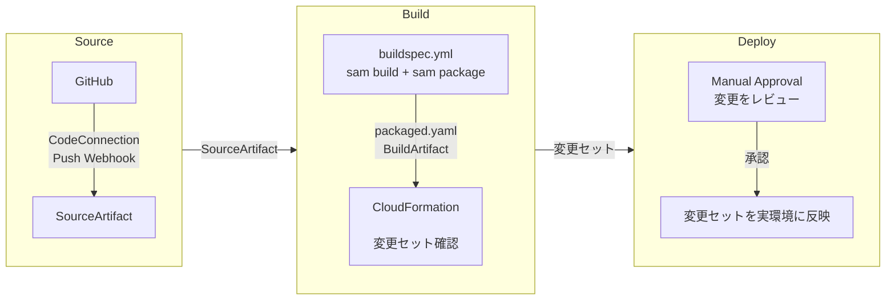

# simple-sam

S3 にアップロードされたファイルを拡張子で判定し、PDF とそれ以外を別々の Lambda が振り分けてコピーする AWS SAM サンプル。

## リポジトリ構成

```text
├─ src/
│  ├─ pdf_copier/
│  │  ├─ app.py                PDF 用ハンドラ（PDF Bucket へコピー）
│  │  └─ requirements.txt      依存パッケージ
│  └─ other_copier/
│     ├─ app.py                PDF 以外用ハンドラ（Other Bucket へコピー）
│     └─ requirements.txt      依存パッケージ
├─ img/
│  └─ architechchar.drawio    システム構成図
├─ template.yaml              SAM アプリケーションスタック
├─ codepipeline.yml           CI/CD ブートストラップスタック
└─ buildspec.yml              CodeBuild のビルドステージ
```

## AWS構成図


- Infrastructure as Code（IaC）として、インフラの定義をコード管理する（[template.yaml](template.yaml)）
- Lambda に載せるアプリケーションも、本リポジトリで管理する（[./src/](./src/)）
- CodePipeline で CI/CD を実現する（[codepipeline.yml](codepipeline.yml)）


## CI/CD([codepipeline.yml](codepipeline.yml))のイメージ

- ビルドステージで実行する内容は[buildspec.yml](buildspec.yml)に記載する



## 構築手順

AWS コンソールから手動で実施する場合

1. **初回のみ**: CloudFormation コンソールで **スタックの作成** → **新しいリソースを使用(標準)** を選択する
2. **テンプレートファイルのアップロード** を選択し、`codepipeline.yml` をアップロードする
3. スタック名に `simple-sam-pipeline` 等を入力する
4. 次のパラメータを入力する
    - `ConnectionArn`: GitHub 用の承認済み CodeConnection ARN (CodePipeline > 設定 > 接続から作成できる)
    - `RepositoryId`: GitHub リポジトリ（`OwnerName/RepositoryName` 形式）
    - `BranchName`: `main`
    - `AppStackName`: 任意のスタック名（例: `stack-simple-sam`）
5. `AWS CloudFormation によって IAM リソースが作成される場合があることを承認します。` のチェックボックスにチェックを入れる
6. スタックを作成する
7. ステータスが`CREATE_COMPLETE` になることを確認
8. `CodePipeline` のコンソールへ移動し、パイプラインが開始されていることを確認(初回は自動実行される)
9. `CreateChangeSet`を選択し、作成・変更されるリソースを確認する
10. Approveで承認を押下
11. リソースが展開される

2回目以降は、GitHub の `main` ブランチへの push または CodePipeline の **Release change** で実行できる。

## 動作確認

AWS コンソールから手動で確認する場合

1. S3 コンソールで Upload Bucket を開く
2. 任意の PDF ファイルをアップロードする
3. PDF Bucket を開き、同じファイルがコピーされていることを確認する
4. PDF 以外の任意のファイルを Upload Bucket にアップロードする
5. Other Bucket を開き、同じファイルがコピーされていることを確認する

反映まで数秒〜数十秒かかる場合がある。反映されない場合は、各 Lambda の CloudWatch Logs でエラーを確認する。

## 実装メモ

### ローカルでLambdaの動作確認をする場合

```bash
python3.12 -m venv .venv
source .venv/bin/activate

# テンプレートを検証
sam validate --lint
cfn-lint template.yaml codepipeline.yml

# ビルド
sam build

# ローカル呼び出し
sam local invoke <FunctionName> -e events/event.json
```
